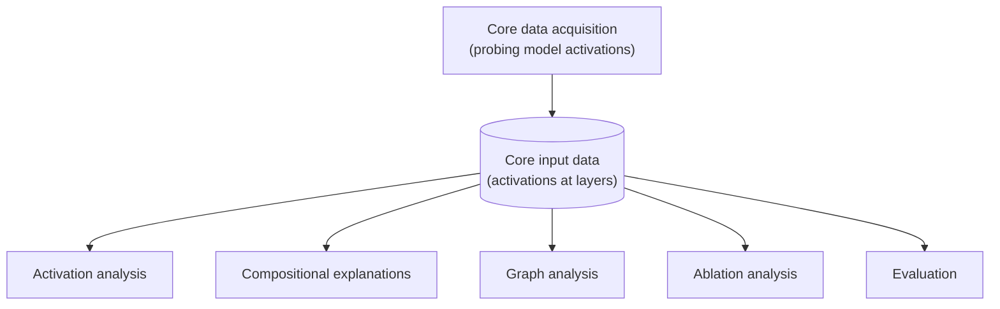

# TaskCE

TaskCE is a research codebase for studying how fine-tuning changes the internal representations of language models. It compares a base model with task-specific LoRA variants by capturing neuron activations and analyzing which internal features remain stable, change behavior, or appear elsewhere in the model.

## Research question

Fine-tuning can improve a model's task performance without showing what changed inside the model.

TaskCE studies those internal changes through a more direct question:

> What happens to the model's internal features when it is fine-tuned for a classification task?

The project examines whether features are preserved in the same neurons, modified, reorganized across neurons, or replaced by new task-related behavior.

## Project structure

The project separates collecting core input data from analyzing it. This diagram shows that broad organization rather than dependencies among individual analyses.

## [Core data acquisition](experimental/)

The acquisition stage uses PyTorch forward hooks to capture the final-token output of selected model layers. Activations are saved as matrices where each row represents a dataset example and each column represents a neuron.

The generation script currently captures activations from the base model and available task-specific LoRA checkpoints.

## [Analyses](theoretical/)

### [Activation analysis](theoretical/activations/)

These analyses operate directly on saved activation matrices.

- **Threshold coverage** measures how many examples activate each neuron after applying a per-neuron quantile threshold. It helps determine whether enough activation evidence exists for formula search.
- **Task separation** applies PCA to the activation space and measures how examples from different task classes are distributed.
- **Neuron fate** compares base and fine-tuned activation spaces. It measures direct neuron correspondence, affine relationships, cross-model similarity, and possible movement of behavior between neurons.

### [Compositional explanations](theoretical/compositional_explanations/)

This component searches for readable formulas that approximate neuron activation patterns. Dataset text is converted into binary token-presence features. These features are combined with logical `AND`, `OR`, and `NOT` operations. Candidate formulas are scored by intersection over union with each thresholded neuron activation vector.

The component contains:

- tokenization and feature construction;
- activation thresholding and low-activation pruning;
- several beam-search and vectorized search implementations;
- symbolic formula rendering and simplification;
- structural comparison of base and fine-tuned formulas;
- CSV and HTML outputs for inspecting formula differences.

### [Graph analysis](theoretical/graph_analysis/)

This component studies relationships between neurons within an activation space. It constructs neuron graphs from Pearson correlation or cosine similarity, removes weaker edges, detects communities, identifies highly connected neurons, and attaches compositional formulas to the resulting graph structure.

This provides a view of how groups of related neurons are organized before and after fine-tuning.

### [Ablation analysis](theoretical/ablation/)

This component tests whether neurons identified by the explanation search affect model behavior. Neurons are ranked using their formula scores and classification weights. Selected groups are then disabled during inference, allowing their effect on task accuracy and class predictions to be measured.

### [Evaluation](theoretical/evaluation/)

This component evaluates base and LoRA-adapted models on their classification tasks. It records successful predictions, incorrect predictions, rejected outputs, and overall accuracy. These measurements separate visible task improvement from changes found by the internal analyses.

## Current study

The current configuration primarily studies:

- **Model:** `LiquidAI/LFM2.5-1.2B-Thinking`
- **Fine-tuning:** task-specific LoRA checkpoints
- **Natural language inference:** Stanford SNLI
- **Claim verification:** VitaminC

The evaluation and task-separation components also contain support for the Logical Fallacy dataset.
