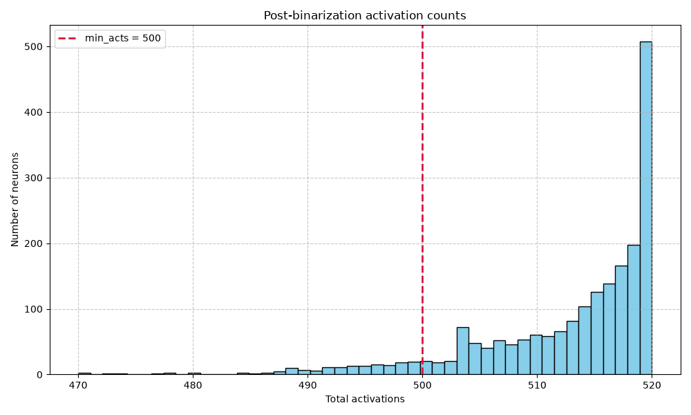
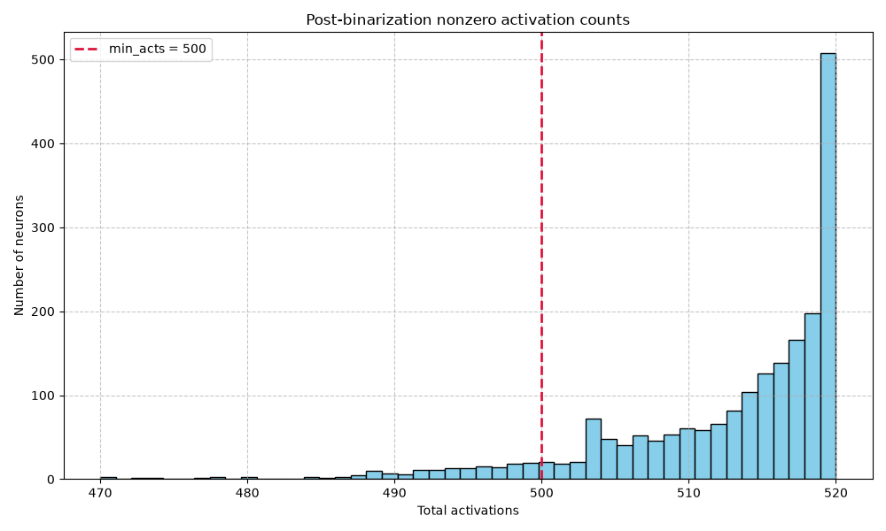

# Activation Diagnostics Report

## RAW ACTIVATION ALPHA SWEEP

min_acts: 500

| Alpha | Zero Count | Zero % | Below Min Count | Below Min % | Kept Count | Kept % | p50 | p75 | p90 | p95 | p99 | Max |
| :--- | :--- | :--- | :--- | :--- | :--- | :--- | :--- | :--- | :--- | :--- | :--- | :--- |
| 0.002 | 0 | 0.000000 | 2048 | 100.000000 | 0 | 0.000000 | 20.000000 | 20.000000 | 20.000000 | 20.000000 | 20.000000 | 20.000000 |
| 0.052 | 0 | 0.000000 | 168 | 8.203125 | 1880 | 91.796875 | 515.000000 | 518.000000 | 520.000000 | 520.000000 | 520.000000 | 520.000000 |
| 0.102 | 0 | 0.000000 | 0 | 0.000000 | 2048 | 100.000000 | 1012.000000 | 1018.000000 | 1020.000000 | 1020.000000 | 1020.000000 | 1020.000000 |
| 0.152 | 0 | 0.000000 | 0 | 0.000000 | 2048 | 100.000000 | 1511.000000 | 1517.000000 | 1520.000000 | 1520.000000 | 1520.000000 | 1520.000000 |

## POST-BINARIZATION ACTIVATION COUNT SUMMARY

| Metric | Value |
| :--- | :--- |
| Zero Activation Count | 0 |
| Zero Activation % | 0.000000 |
| Below Min Acts Count | 168 |
| Below Min Acts % | 8.203125 |
| Kept Count | 1880 |
| Kept % | 91.796875 |
| p50 | 515.000000 |
| p75 | 518.000000 |
| p90 | 520.000000 |
| p95 | 520.000000 |
| p99 | 520.000000 |
| Max | 520.000000 |

## SIMILARITY & CORRELATION ANALYSIS

### Pearson Correlation

#### Top Pearson Correlation Neuron Pairs

**Pearson correlation base**
```
Top positive pairs
  neuron 764 <-> neuron 1449: 0.802546
  neuron 778 <-> neuron 2036: 0.799058
  neuron 156 <-> neuron 322: 0.795225
  neuron 132 <-> neuron 751: 0.779179
  neuron 1044 <-> neuron 1535: 0.776079
  neuron 135 <-> neuron 751: 0.770839
  neuron 970 <-> neuron 1025: 0.769022
  neuron 751 <-> neuron 1292: 0.768649
  neuron 400 <-> neuron 1038: 0.766969
  neuron 433 <-> neuron 778: 0.765192
Top negative pairs
  neuron 1038 <-> neuron 1046: -0.840317
  neuron 751 <-> neuron 1499: -0.803632
  neuron 751 <-> neuron 1267: -0.799590
  neuron 764 <-> neuron 780: -0.787368
  neuron 132 <-> neuron 962: -0.785360
  neuron 751 <-> neuron 1038: -0.780112
  neuron 370 <-> neuron 1686: -0.773606
  neuron 1046 <-> neuron 1499: -0.773137
  neuron 29 <-> neuron 1626: -0.770395
  neuron 135 <-> neuron 1025: -0.769051
```

**Pearson correlation finetuned**
```
Top positive pairs
  neuron 888 <-> neuron 1424: 0.870268
  neuron 888 <-> neuron 1584: 0.858508
  neuron 12 <-> neuron 1584: 0.858162
  neuron 1169 <-> neuron 1464: 0.853069
  neuron 888 <-> neuron 1755: 0.853058
  neuron 691 <-> neuron 888: 0.847832
  neuron 1166 <-> neuron 1544: 0.845559
  neuron 897 <-> neuron 1169: 0.842410
  neuron 571 <-> neuron 1424: 0.841190
  neuron 725 <-> neuron 1166: 0.839756
Top negative pairs
  neuron 1424 <-> neuron 1917: -0.862934
  neuron 70 <-> neuron 1166: -0.856614
  neuron 650 <-> neuron 1166: -0.856133
  neuron 172 <-> neuron 1166: -0.855677
  neuron 70 <-> neuron 576: -0.853011
  neuron 1372 <-> neuron 1424: -0.850481
  neuron 576 <-> neuron 1169: -0.848130
  neuron 70 <-> neuron 1544: -0.845583
  neuron 888 <-> neuron 1354: -0.844929
  neuron 888 <-> neuron 1166: -0.844343
```

**Pearson correlation difference**
```
Top increased pairs
  neuron 707 <-> neuron 955: 1.345518
  neuron 648 <-> neuron 1482: 1.323220
  neuron 97 <-> neuron 699: 1.301130
  neuron 707 <-> neuron 804: 1.289637
  neuron 1489 <-> neuron 1668: 1.284301
  neuron 1096 <-> neuron 1482: 1.275955
  neuron 1103 <-> neuron 1482: 1.267492
  neuron 1096 <-> neuron 1486: 1.264380
  neuron 1755 <-> neuron 1898: 1.262062
  neuron 707 <-> neuron 1096: 1.260855
Top decreased pairs
  neuron 194 <-> neuron 707: -1.476627
  neuron 154 <-> neuron 707: -1.363644
  neuron 70 <-> neuron 1354: -1.352822
  neuron 1482 <-> neuron 1755: -1.341494
  neuron 640 <-> neuron 1621: -1.317113
  neuron 1621 <-> neuron 1668: -1.314072
  neuron 154 <-> neuron 1482: -1.310704
  neuron 348 <-> neuron 1253: -1.300219
  neuron 383 <-> neuron 1602: -1.289402
  neuron 97 <-> neuron 1805: -1.283752
```

### Cosine Similarity

#### Top Cosine Similarity Neuron Pairs

**Cosine similarity base**
```
Top positive pairs
  neuron 318 <-> neuron 1957: 0.997229
  neuron 1004 <-> neuron 1957: 0.996755
  neuron 573 <-> neuron 1004: 0.996394
  neuron 1365 <-> neuron 1709: 0.996363
  neuron 394 <-> neuron 1964: 0.996322
  neuron 135 <-> neuron 751: 0.996286
  neuron 1004 <-> neuron 1365: 0.996219
  neuron 1155 <-> neuron 1525: 0.996172
  neuron 912 <-> neuron 1004: 0.996153
  neuron 501 <-> neuron 1146: 0.996098
Top negative pairs
  neuron 751 <-> neuron 978: -0.996142
  neuron 1315 <-> neuron 1957: -0.996075
  neuron 1146 <-> neuron 1247: -0.996055
  neuron 1004 <-> neuron 1315: -0.996039
  neuron 1155 <-> neuron 1733: -0.996019
  neuron 573 <-> neuron 751: -0.995983
  neuron 434 <-> neuron 1957: -0.995931
  neuron 330 <-> neuron 1871: -0.995918
  neuron 318 <-> neuron 434: -0.995814
  neuron 751 <-> neuron 1957: -0.995763
```

**Cosine similarity finetuned**
```
Top positive pairs
  neuron 318 <-> neuron 971: 0.994964
  neuron 318 <-> neuron 958: 0.993049
  neuron 318 <-> neuron 1336: 0.992755
  neuron 318 <-> neuron 501: 0.992136
  neuron 971 <-> neuron 1336: 0.991086
  neuron 434 <-> neuron 1494: 0.990754
  neuron 330 <-> neuron 1443: 0.990721
  neuron 434 <-> neuron 1443: 0.990581
  neuron 318 <-> neuron 1146: 0.990374
  neuron 330 <-> neuron 434: 0.990244
Top negative pairs
  neuron 318 <-> neuron 434: -0.993709
  neuron 318 <-> neuron 1443: -0.993402
  neuron 318 <-> neuron 330: -0.993008
  neuron 558 <-> neuron 971: -0.991366
  neuron 318 <-> neuron 1030: -0.991187
  neuron 434 <-> neuron 971: -0.990857
  neuron 971 <-> neuron 1443: -0.990822
  neuron 318 <-> neuron 558: -0.990605
  neuron 330 <-> neuron 971: -0.990578
  neuron 330 <-> neuron 393: -0.990470
```

**Cosine similarity difference**
```
Top increased pairs
  neuron 434 <-> neuron 1918: 1.957757
  neuron 318 <-> neuron 412: 1.955801
  neuron 412 <-> neuron 1601: 1.954166
  neuron 14 <-> neuron 330: 1.954109
  neuron 730 <-> neuron 1918: 1.953873
  neuron 14 <-> neuron 1212: 1.951169
  neuron 14 <-> neuron 434: 1.950623
  neuron 552 <-> neuron 1918: 1.950522
  neuron 1324 <-> neuron 1918: 1.948539
  neuron 412 <-> neuron 958: 1.948158
Top decreased pairs
  neuron 14 <-> neuron 318: -1.959783
  neuron 318 <-> neuron 1918: -1.958253
  neuron 14 <-> neuron 958: -1.957175
  neuron 14 <-> neuron 501: -1.955775
  neuron 1455 <-> neuron 1918: -1.955019
  neuron 412 <-> neuron 434: -1.954454
  neuron 1492 <-> neuron 1918: -1.952247
  neuron 14 <-> neuron 362: -1.950394
  neuron 1146 <-> neuron 1918: -1.950300
  neuron 14 <-> neuron 1146: -1.949997
```

## VISUALIZATIONS

### Post-Binarization Activation Count Histograms

| Full Histogram | Nonzero Histogram |
| :---: | :---: |
|  |  |

### Binarized Activation Jaccard Similarity

#### Jaccard Similarity / IoU Heatmap


### Pearson Correlation Heatmaps

| Base Heatmap | Finetuned Heatmap | Difference Heatmap |
| :---: | :---: | :---: |
|  |  |  |

### Cosine Similarity Heatmaps

| Base Heatmap | Finetuned Heatmap | Difference Heatmap |
| :---: | :---: | :---: |
|  |  |  |

