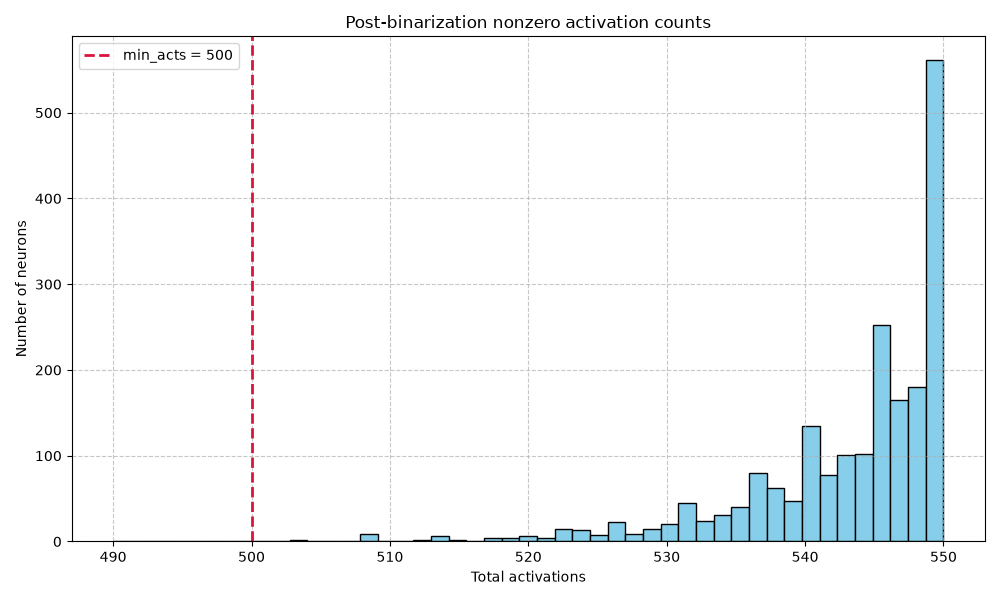

# Activation Diagnostics Report

## RAW ACTIVATION ALPHA SWEEP

min_acts: 500

| Alpha | Zero Count | Zero % | Below Min Count | Below Min % | Kept Count | Kept % | p50 | p75 | p90 | p95 | p99 | Max |
| :--- | :--- | :--- | :--- | :--- | :--- | :--- | :--- | :--- | :--- | :--- | :--- | :--- |
| 0.005 | 0 | 0.000000 | 2048 | 100.000000 | 0 | 0.000000 | 49.000000 | 50.000000 | 50.000000 | 50.000000 | 50.000000 | 50.000000 |
| 0.055 | 0 | 0.000000 | 2 | 0.097656 | 2046 | 99.902344 | 546.000000 | 549.000000 | 550.000000 | 550.000000 | 550.000000 | 550.000000 |
| 0.105 | 0 | 0.000000 | 0 | 0.000000 | 2048 | 100.000000 | 1044.000000 | 1048.000000 | 1050.000000 | 1050.000000 | 1050.000000 | 1050.000000 |
| 0.155 | 0 | 0.000000 | 0 | 0.000000 | 2048 | 100.000000 | 1542.000000 | 1548.000000 | 1550.000000 | 1550.000000 | 1550.000000 | 1550.000000 |

## POST-BINARIZATION ACTIVATION COUNT SUMMARY

| Metric | Value |
| :--- | :--- |
| Zero Activation Count | 0 |
| Zero Activation % | 0.000000 |
| Below Min Acts Count | 2 |
| Below Min Acts % | 0.097656 |
| Kept Count | 2046 |
| Kept % | 99.902344 |
| p50 | 546.000000 |
| p75 | 549.000000 |
| p90 | 550.000000 |
| p95 | 550.000000 |
| p99 | 550.000000 |
| Max | 550.000000 |

## SIMILARITY & CORRELATION ANALYSIS

### Pearson Correlation

#### Top Pearson Correlation Neuron Pairs

**Pearson correlation base**
```
Top positive pairs
  neuron 199 <-> neuron 1112: 0.766642
  neuron 558 <-> neuron 1096: 0.765195
  neuron 1834 <-> neuron 1970: 0.762605
  neuron 285 <-> neuron 652: 0.757925
  neuron 1404 <-> neuron 1879: 0.755479
  neuron 652 <-> neuron 1096: 0.748839
  neuron 1404 <-> neuron 2026: 0.747634
  neuron 119 <-> neuron 199: 0.745153
  neuron 330 <-> neuron 1060: 0.743226
  neuron 758 <-> neuron 1656: 0.742503
Top negative pairs
  neuron 86 <-> neuron 201: -0.773984
  neuron 372 <-> neuron 1280: -0.763679
  neuron 264 <-> neuron 1921: -0.761769
  neuron 1096 <-> neuron 1404: -0.761078
  neuron 86 <-> neuron 1829: -0.760468
  neuron 819 <-> neuron 1054: -0.753665
  neuron 631 <-> neuron 1150: -0.751736
  neuron 372 <-> neuron 1404: -0.750637
  neuron 1150 <-> neuron 1921: -0.748068
  neuron 285 <-> neuron 1404: -0.742006
```

**Pearson correlation finetuned**
```
Top positive pairs
  neuron 657 <-> neuron 1106: 0.861662
  neuron 20 <-> neuron 1262: 0.856966
  neuron 1558 <-> neuron 1849: 0.841447
  neuron 252 <-> neuron 1146: 0.839522
  neuron 20 <-> neuron 780: 0.837682
  neuron 20 <-> neuron 1370: 0.835870
  neuron 1262 <-> neuron 1370: 0.825581
  neuron 780 <-> neuron 2032: 0.825376
  neuron 327 <-> neuron 1106: 0.825214
  neuron 444 <-> neuron 1524: 0.824208
Top negative pairs
  neuron 1445 <-> neuron 1863: -0.838469
  neuron 657 <-> neuron 1558: -0.837795
  neuron 657 <-> neuron 1801: -0.833458
  neuron 1192 <-> neuron 1849: -0.826808
  neuron 1379 <-> neuron 1524: -0.824578
  neuron 744 <-> neuron 1970: -0.824360
  neuron 327 <-> neuron 1849: -0.821339
  neuron 20 <-> neuron 1970: -0.818971
  neuron 1379 <-> neuron 1445: -0.816110
  neuron 1370 <-> neuron 1970: -0.815502
```

**Pearson correlation difference**
```
Top increased pairs
  neuron 1438 <-> neuron 1645: 1.282752
  neuron 1944 <-> neuron 1970: 1.258327
  neuron 257 <-> neuron 1006: 1.236983
  neuron 74 <-> neuron 120: 1.213796
  neuron 434 <-> neuron 1438: 1.185900
  neuron 1020 <-> neuron 1465: 1.179244
  neuron 1227 <-> neuron 1407: 1.172239
  neuron 20 <-> neuron 1407: 1.170943
  neuron 1438 <-> neuron 1859: 1.167738
  neuron 1801 <-> neuron 1944: 1.165654
Top decreased pairs
  neuron 1069 <-> neuron 1422: -1.226201
  neuron 1261 <-> neuron 1407: -1.222931
  neuron 120 <-> neuron 499: -1.204707
  neuron 252 <-> neuron 255: -1.185902
  neuron 1407 <-> neuron 1970: -1.176091
  neuron 74 <-> neuron 1394: -1.170662
  neuron 257 <-> neuron 1280: -1.161614
  neuron 423 <-> neuron 1970: -1.157347
  neuron 460 <-> neuron 741: -1.156905
  neuron 63 <-> neuron 1811: -1.152022
```

### Cosine Similarity

#### Top Cosine Similarity Neuron Pairs

**Cosine similarity base**
```
Top positive pairs
  neuron 349 <-> neuron 717: 0.996680
  neuron 278 <-> neuron 1945: 0.996231
  neuron 717 <-> neuron 1381: 0.996054
  neuron 278 <-> neuron 1049: 0.995779
  neuron 854 <-> neuron 1059: 0.995633
  neuron 278 <-> neuron 1076: 0.995571
  neuron 1435 <-> neuron 1884: 0.995570
  neuron 349 <-> neuron 901: 0.995565
  neuron 349 <-> neuron 1381: 0.995434
  neuron 237 <-> neuron 854: 0.995425
Top negative pairs
  neuron 717 <-> neuron 1049: -0.996820
  neuron 854 <-> neuron 1689: -0.996694
  neuron 1381 <-> neuron 1714: -0.996231
  neuron 278 <-> neuron 901: -0.996105
  neuron 1049 <-> neuron 1218: -0.996082
  neuron 1381 <-> neuron 1954: -0.996049
  neuron 599 <-> neuron 1884: -0.995721
  neuron 349 <-> neuron 1049: -0.995706
  neuron 485 <-> neuron 717: -0.995651
  neuron 1435 <-> neuron 1839: -0.995629
```

**Cosine similarity finetuned**
```
Top positive pairs
  neuron 1381 <-> neuron 1846: 0.988196
  neuron 195 <-> neuron 1172: 0.988108
  neuron 1218 <-> neuron 1846: 0.987776
  neuron 1028 <-> neuron 1706: 0.986987
  neuron 349 <-> neuron 764: 0.986949
  neuron 488 <-> neuron 1381: 0.986917
  neuron 349 <-> neuron 1846: 0.986622
  neuron 349 <-> neuron 1058: 0.986541
  neuron 349 <-> neuron 1218: 0.986346
  neuron 764 <-> neuron 1218: 0.986234
Top negative pairs
  neuron 139 <-> neuron 1218: -0.989385
  neuron 139 <-> neuron 1381: -0.987999
  neuron 237 <-> neuron 1218: -0.986896
  neuron 139 <-> neuron 537: -0.986682
  neuron 139 <-> neuron 764: -0.986447
  neuron 349 <-> neuron 1009: -0.986403
  neuron 525 <-> neuron 1381: -0.986386
  neuron 349 <-> neuron 1028: -0.986211
  neuron 1478 <-> neuron 1706: -0.986022
  neuron 1706 <-> neuron 1754: -0.985904
```

**Cosine similarity difference**
```
Top increased pairs
  neuron 349 <-> neuron 354: 1.949611
  neuron 354 <-> neuron 807: 1.948283
  neuron 354 <-> neuron 1807: 1.947769
  neuron 354 <-> neuron 1760: 1.944492
  neuron 354 <-> neuron 1754: 1.943571
  neuron 354 <-> neuron 1274: 1.942493
  neuron 354 <-> neuron 743: 1.940859
  neuron 354 <-> neuron 1911: 1.940269
  neuron 354 <-> neuron 1381: 1.940194
  neuron 354 <-> neuron 1689: 1.938805
Top decreased pairs
  neuron 354 <-> neuron 1884: -1.950876
  neuron 354 <-> neuron 995: -1.948185
  neuron 354 <-> neuron 613: -1.946147
  neuron 354 <-> neuron 775: -1.944168
  neuron 354 <-> neuron 1553: -1.943310
  neuron 354 <-> neuron 371: -1.941840
  neuron 237 <-> neuron 354: -1.940990
  neuron 354 <-> neuron 1009: -1.940689
  neuron 354 <-> neuron 1172: -1.940135
  neuron 1323 <-> neuron 1381: -1.939427
```

## VISUALIZATIONS

### Post-Binarization Activation Count Histograms

| Full Histogram | Nonzero Histogram |
| :---: | :---: |
|  |  |

### Binarized Activation Jaccard Similarity

#### Jaccard Similarity / IoU Heatmap


### Pearson Correlation Heatmaps

| Base Heatmap | Finetuned Heatmap | Difference Heatmap |
| :---: | :---: | :---: |
|  |  |  |

### Cosine Similarity Heatmaps

| Base Heatmap | Finetuned Heatmap | Difference Heatmap |
| :---: | :---: | :---: |
|  |  |  |

