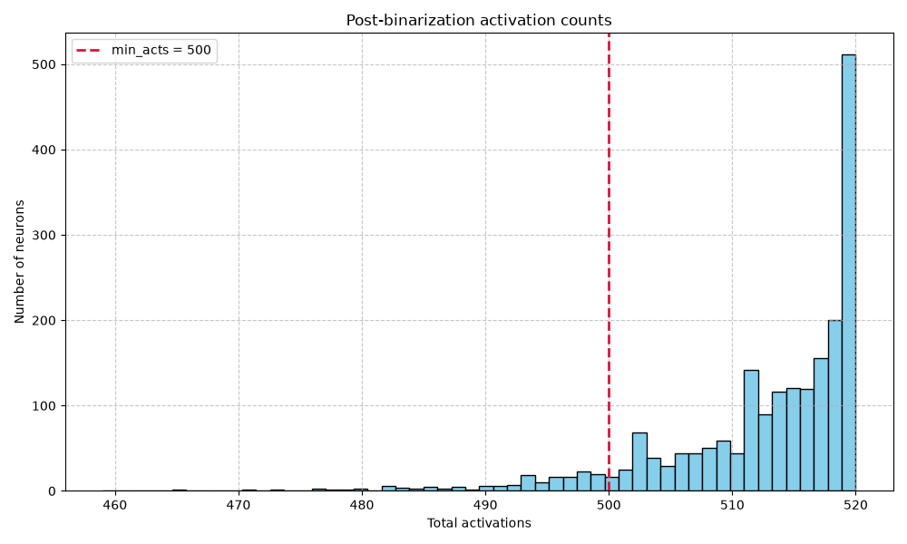
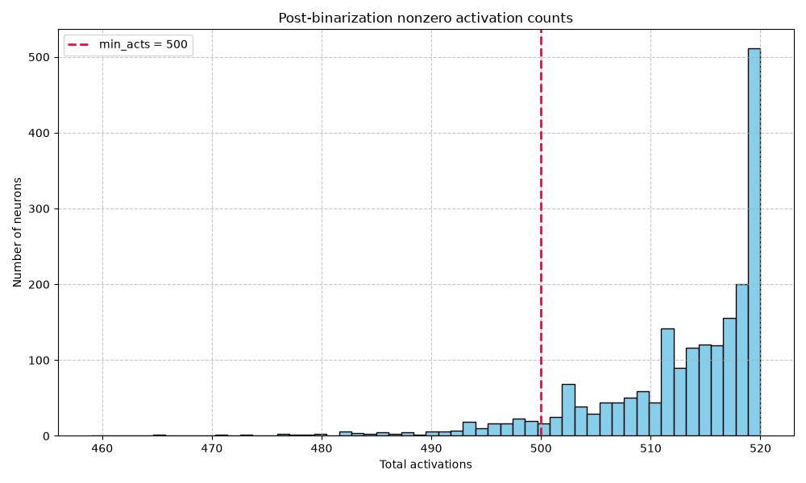

# Activation Diagnostics Report

## RAW ACTIVATION ALPHA SWEEP

min_acts: 500

| Alpha | Zero Count | Zero % | Below Min Count | Below Min % | Kept Count | Kept % | p50 | p75 | p90 | p95 | p99 | Max |
| :--- | :--- | :--- | :--- | :--- | :--- | :--- | :--- | :--- | :--- | :--- | :--- | :--- |
| 0.002 | 0 | 0.000000 | 2048 | 100.000000 | 0 | 0.000000 | 20.000000 | 20.000000 | 20.000000 | 20.000000 | 20.000000 | 20.000000 |
| 0.052 | 0 | 0.000000 | 174 | 8.496094 | 1874 | 91.503906 | 515.000000 | 518.000000 | 520.000000 | 520.000000 | 520.000000 | 520.000000 |
| 0.102 | 0 | 0.000000 | 0 | 0.000000 | 2048 | 100.000000 | 1013.000000 | 1018.000000 | 1020.000000 | 1020.000000 | 1020.000000 | 1020.000000 |
| 0.152 | 0 | 0.000000 | 0 | 0.000000 | 2048 | 100.000000 | 1511.000000 | 1517.000000 | 1519.000000 | 1520.000000 | 1520.000000 | 1520.000000 |

## POST-BINARIZATION ACTIVATION COUNT SUMMARY

| Metric | Value |
| :--- | :--- |
| Zero Activation Count | 0 |
| Zero Activation % | 0.000000 |
| Below Min Acts Count | 174 |
| Below Min Acts % | 8.496094 |
| Kept Count | 1874 |
| Kept % | 91.503906 |
| p50 | 515.000000 |
| p75 | 518.000000 |
| p90 | 520.000000 |
| p95 | 520.000000 |
| p99 | 520.000000 |
| Max | 520.000000 |

## SIMILARITY & CORRELATION ANALYSIS

### Pearson Correlation

#### Top Pearson Correlation Neuron Pairs

**Pearson correlation base**
```
Top positive pairs
  neuron 764 <-> neuron 1449: 0.803611
  neuron 778 <-> neuron 2036: 0.798709
  neuron 156 <-> neuron 322: 0.793946
  neuron 132 <-> neuron 751: 0.780945
  neuron 1044 <-> neuron 1535: 0.778381
  neuron 970 <-> neuron 1025: 0.771209
  neuron 135 <-> neuron 751: 0.770753
  neuron 751 <-> neuron 1292: 0.769750
  neuron 400 <-> neuron 1038: 0.766568
  neuron 433 <-> neuron 778: 0.765909
Top negative pairs
  neuron 1038 <-> neuron 1046: -0.841574
  neuron 751 <-> neuron 1499: -0.805596
  neuron 751 <-> neuron 1267: -0.800853
  neuron 764 <-> neuron 780: -0.790016
  neuron 132 <-> neuron 962: -0.787668
  neuron 751 <-> neuron 1038: -0.780887
  neuron 370 <-> neuron 1686: -0.773461
  neuron 1046 <-> neuron 1499: -0.773118
  neuron 29 <-> neuron 1626: -0.770886
  neuron 135 <-> neuron 1025: -0.770130
```

**Pearson correlation finetuned**
```
Top positive pairs
  neuron 888 <-> neuron 1424: 0.869698
  neuron 888 <-> neuron 1584: 0.857757
  neuron 12 <-> neuron 1584: 0.857503
  neuron 1169 <-> neuron 1464: 0.853144
  neuron 888 <-> neuron 1755: 0.853012
  neuron 691 <-> neuron 888: 0.846371
  neuron 1166 <-> neuron 1544: 0.844588
  neuron 897 <-> neuron 1169: 0.842710
  neuron 571 <-> neuron 1424: 0.840321
  neuron 1169 <-> neuron 1424: 0.839054
Top negative pairs
  neuron 1424 <-> neuron 1917: -0.862338
  neuron 70 <-> neuron 1166: -0.856199
  neuron 172 <-> neuron 1166: -0.855454
  neuron 650 <-> neuron 1166: -0.855243
  neuron 70 <-> neuron 576: -0.853328
  neuron 1372 <-> neuron 1424: -0.849630
  neuron 576 <-> neuron 1169: -0.847729
  neuron 70 <-> neuron 1544: -0.844772
  neuron 888 <-> neuron 1354: -0.843643
  neuron 888 <-> neuron 1166: -0.843553
```

**Pearson correlation difference**
```
Top increased pairs
  neuron 707 <-> neuron 955: 1.342794
  neuron 648 <-> neuron 1482: 1.318338
  neuron 97 <-> neuron 699: 1.301973
  neuron 707 <-> neuron 804: 1.289306
  neuron 1489 <-> neuron 1668: 1.284439
  neuron 1096 <-> neuron 1482: 1.275435
  neuron 1103 <-> neuron 1482: 1.268024
  neuron 1096 <-> neuron 1486: 1.265544
  neuron 707 <-> neuron 1096: 1.264866
  neuron 1755 <-> neuron 1898: 1.258852
Top decreased pairs
  neuron 194 <-> neuron 707: -1.477412
  neuron 154 <-> neuron 707: -1.362192
  neuron 70 <-> neuron 1354: -1.355103
  neuron 1482 <-> neuron 1755: -1.342990
  neuron 640 <-> neuron 1621: -1.319693
  neuron 154 <-> neuron 1482: -1.312224
  neuron 1621 <-> neuron 1668: -1.311782
  neuron 348 <-> neuron 1253: -1.301219
  neuron 383 <-> neuron 1602: -1.292812
  neuron 97 <-> neuron 1805: -1.284266
```

### Cosine Similarity

#### Top Cosine Similarity Neuron Pairs

**Cosine similarity base**
```
Top positive pairs
  neuron 318 <-> neuron 1957: 0.997225
  neuron 1004 <-> neuron 1957: 0.996762
  neuron 1365 <-> neuron 1709: 0.996378
  neuron 573 <-> neuron 1004: 0.996362
  neuron 394 <-> neuron 1964: 0.996350
  neuron 135 <-> neuron 751: 0.996262
  neuron 1004 <-> neuron 1365: 0.996242
  neuron 1155 <-> neuron 1525: 0.996219
  neuron 912 <-> neuron 1004: 0.996153
  neuron 501 <-> neuron 1146: 0.996110
Top negative pairs
  neuron 751 <-> neuron 978: -0.996135
  neuron 1315 <-> neuron 1957: -0.996108
  neuron 1146 <-> neuron 1247: -0.996072
  neuron 1004 <-> neuron 1315: -0.996050
  neuron 1155 <-> neuron 1733: -0.995978
  neuron 573 <-> neuron 751: -0.995976
  neuron 434 <-> neuron 1957: -0.995942
  neuron 330 <-> neuron 1871: -0.995901
  neuron 318 <-> neuron 434: -0.995797
  neuron 751 <-> neuron 1004: -0.995757
```

**Cosine similarity finetuned**
```
Top positive pairs
  neuron 318 <-> neuron 971: 0.994967
  neuron 318 <-> neuron 958: 0.993058
  neuron 318 <-> neuron 1336: 0.992741
  neuron 318 <-> neuron 501: 0.992184
  neuron 971 <-> neuron 1336: 0.991071
  neuron 434 <-> neuron 1494: 0.990817
  neuron 330 <-> neuron 1443: 0.990701
  neuron 434 <-> neuron 1443: 0.990636
  neuron 318 <-> neuron 1146: 0.990407
  neuron 330 <-> neuron 434: 0.990237
Top negative pairs
  neuron 318 <-> neuron 434: -0.993718
  neuron 318 <-> neuron 1443: -0.993424
  neuron 318 <-> neuron 330: -0.993006
  neuron 558 <-> neuron 971: -0.991367
  neuron 318 <-> neuron 1030: -0.991251
  neuron 971 <-> neuron 1443: -0.990847
  neuron 434 <-> neuron 971: -0.990840
  neuron 318 <-> neuron 558: -0.990619
  neuron 330 <-> neuron 971: -0.990580
  neuron 330 <-> neuron 393: -0.990456
```

**Cosine similarity difference**
```
Top increased pairs
  neuron 434 <-> neuron 1918: 1.957484
  neuron 318 <-> neuron 412: 1.956150
  neuron 412 <-> neuron 1601: 1.954471
  neuron 14 <-> neuron 330: 1.953804
  neuron 730 <-> neuron 1918: 1.953535
  neuron 14 <-> neuron 1212: 1.951043
  neuron 14 <-> neuron 434: 1.950373
  neuron 552 <-> neuron 1918: 1.950249
  neuron 1324 <-> neuron 1918: 1.948816
  neuron 412 <-> neuron 958: 1.948510
Top decreased pairs
  neuron 14 <-> neuron 318: -1.959527
  neuron 318 <-> neuron 1918: -1.958021
  neuron 14 <-> neuron 958: -1.956934
  neuron 14 <-> neuron 501: -1.955531
  neuron 1455 <-> neuron 1918: -1.954996
  neuron 412 <-> neuron 434: -1.954605
  neuron 1492 <-> neuron 1918: -1.952205
  neuron 14 <-> neuron 362: -1.950111
  neuron 1146 <-> neuron 1918: -1.949999
  neuron 14 <-> neuron 1146: -1.949758
```

## VISUALIZATIONS

### Post-Binarization Activation Count Histograms

| Full Histogram | Nonzero Histogram |
| :---: | :---: |
|  |  |

### Binarized Activation Jaccard Similarity

#### Jaccard Similarity / IoU Heatmap


### Pearson Correlation Heatmaps

| Base Heatmap | Finetuned Heatmap | Difference Heatmap |
| :---: | :---: | :---: |
|  |  |  |

### Cosine Similarity Heatmaps

| Base Heatmap | Finetuned Heatmap | Difference Heatmap |
| :---: | :---: | :---: |
|  |  |  |

