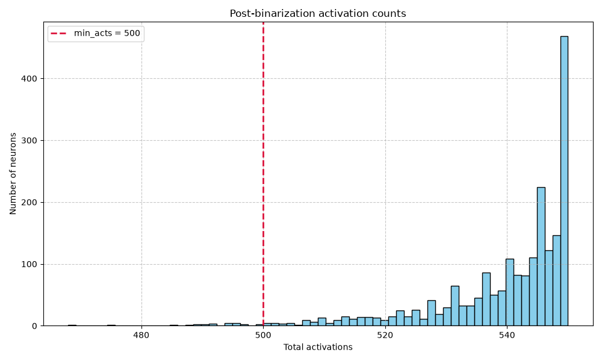

# Activation Diagnostics Report

## RAW ACTIVATION ALPHA SWEEP

min_acts: 500

| Alpha | Zero Count | Zero % | Below Min Count | Below Min % | Kept Count | Kept % | p50 | p75 | p90 | p95 | p99 | Max |
| :--- | :--- | :--- | :--- | :--- | :--- | :--- | :--- | :--- | :--- | :--- | :--- | :--- |
| 0.005 | 0 | 0.000000 | 2048 | 100.000000 | 0 | 0.000000 | 49.000000 | 50.000000 | 50.000000 | 50.000000 | 50.000000 | 50.000000 |
| 0.055 | 0 | 0.000000 | 22 | 1.074219 | 2026 | 98.925781 | 544.000000 | 548.000000 | 550.000000 | 550.000000 | 550.000000 | 550.000000 |
| 0.105 | 0 | 0.000000 | 0 | 0.000000 | 2048 | 100.000000 | 1041.000000 | 1047.000000 | 1050.000000 | 1050.000000 | 1050.000000 | 1050.000000 |
| 0.155 | 0 | 0.000000 | 0 | 0.000000 | 2048 | 100.000000 | 1540.000000 | 1547.000000 | 1549.000000 | 1550.000000 | 1550.000000 | 1550.000000 |

## POST-BINARIZATION ACTIVATION COUNT SUMMARY

| Metric | Value |
| :--- | :--- |
| Zero Activation Count | 0 |
| Zero Activation % | 0.000000 |
| Below Min Acts Count | 22 |
| Below Min Acts % | 1.074219 |
| Kept Count | 2026 |
| Kept % | 98.925781 |
| p50 | 544.000000 |
| p75 | 548.000000 |
| p90 | 550.000000 |
| p95 | 550.000000 |
| p99 | 550.000000 |
| Max | 550.000000 |

## SIMILARITY & CORRELATION ANALYSIS

### Pearson Correlation

#### Top Pearson Correlation Neuron Pairs

**Pearson correlation base**
```
Top positive pairs
  neuron 710 <-> neuron 1791: 0.833527
  neuron 237 <-> neuron 1686: 0.831189
  neuron 962 <-> neuron 1818: 0.829136
  neuron 144 <-> neuron 789: 0.827253
  neuron 718 <-> neuron 1972: 0.823732
  neuron 683 <-> neuron 1686: 0.816701
  neuron 311 <-> neuron 433: 0.816339
  neuron 493 <-> neuron 898: 0.815354
  neuron 10 <-> neuron 1964: 0.813385
  neuron 240 <-> neuron 710: 0.808251
Top negative pairs
  neuron 1519 <-> neuron 1964: -0.861429
  neuron 370 <-> neuron 1686: -0.860658
  neuron 747 <-> neuron 1051: -0.824971
  neuron 28 <-> neuron 789: -0.815427
  neuron 1461 <-> neuron 2035: -0.812320
  neuron 237 <-> neuron 1235: -0.811556
  neuron 123 <-> neuron 1778: -0.811190
  neuron 240 <-> neuron 888: -0.808802
  neuron 898 <-> neuron 1719: -0.807878
  neuron 1791 <-> neuron 1795: -0.806170
```

**Pearson correlation finetuned**
```
Top positive pairs
  neuron 915 <-> neuron 1888: 0.967156
  neuron 696 <-> neuron 748: 0.963079
  neuron 696 <-> neuron 1633: 0.960613
  neuron 781 <-> neuron 1527: 0.959902
  neuron 781 <-> neuron 1335: 0.959285
  neuron 696 <-> neuron 1888: 0.958043
  neuron 1527 <-> neuron 1943: 0.957081
  neuron 1061 <-> neuron 1335: 0.956809
  neuron 1527 <-> neuron 1911: 0.956209
  neuron 257 <-> neuron 1888: 0.955302
Top negative pairs
  neuron 1527 <-> neuron 1888: -0.969737
  neuron 257 <-> neuron 1527: -0.966725
  neuron 696 <-> neuron 1527: -0.966280
  neuron 696 <-> neuron 781: -0.962657
  neuron 781 <-> neuron 1888: -0.961209
  neuron 781 <-> neuron 915: -0.961172
  neuron 915 <-> neuron 1205: -0.960154
  neuron 97 <-> neuron 1633: -0.958944
  neuron 1527 <-> neuron 1633: -0.955135
  neuron 748 <-> neuron 1527: -0.954758
```

**Pearson correlation difference**
```
Top increased pairs
  neuron 789 <-> neuron 1136: 1.599979
  neuron 269 <-> neuron 710: 1.579138
  neuron 751 <-> neuron 986: 1.550004
  neuron 962 <-> neuron 1786: 1.547515
  neuron 986 <-> neuron 1924: 1.545206
  neuron 50 <-> neuron 1924: 1.541227
  neuron 1532 <-> neuron 1834: 1.538297
  neuron 1127 <-> neuron 1987: 1.537052
  neuron 440 <-> neuron 1633: 1.526929
  neuron 701 <-> neuron 1008: 1.525498
Top decreased pairs
  neuron 135 <-> neuron 751: -1.590098
  neuron 433 <-> neuron 701: -1.586278
  neuron 2 <-> neuron 710: -1.579534
  neuron 177 <-> neuron 536: -1.569650
  neuron 2 <-> neuron 86: -1.569532
  neuron 440 <-> neuron 778: -1.569315
  neuron 269 <-> neuron 1662: -1.566199
  neuron 269 <-> neuron 1834: -1.564114
  neuron 751 <-> neuron 1435: -1.560949
  neuron 2 <-> neuron 240: -1.545527
```

### Cosine Similarity

#### Top Cosine Similarity Neuron Pairs

**Cosine similarity base**
```
Top positive pairs
  neuron 318 <-> neuron 1146: 0.997035
  neuron 318 <-> neuron 1455: 0.997023
  neuron 318 <-> neuron 1492: 0.996440
  neuron 318 <-> neuron 329: 0.996342
  neuron 394 <-> neuron 434: 0.996328
  neuron 318 <-> neuron 1386: 0.995912
  neuron 318 <-> neuron 1959: 0.995910
  neuron 1386 <-> neuron 1492: 0.995891
  neuron 1386 <-> neuron 1455: 0.995716
  neuron 1455 <-> neuron 1492: 0.995651
Top negative pairs
  neuron 394 <-> neuron 573: -0.996844
  neuron 318 <-> neuron 1923: -0.996280
  neuron 425 <-> neuron 912: -0.996249
  neuron 1492 <-> neuron 1923: -0.995871
  neuron 454 <-> neuron 1709: -0.995863
  neuron 169 <-> neuron 318: -0.995793
  neuron 318 <-> neuron 425: -0.995745
  neuron 978 <-> neuron 1923: -0.995608
  neuron 978 <-> neuron 1865: -0.995506
  neuron 958 <-> neuron 1107: -0.995499
```

**Cosine similarity finetuned**
```
Top positive pairs
  neuron 634 <-> neuron 1038: 0.995979
  neuron 985 <-> neuron 987: 0.995283
  neuron 1038 <-> neuron 1602: 0.994858
  neuron 1441 <-> neuron 1919: 0.994808
  neuron 634 <-> neuron 698: 0.994782
  neuron 423 <-> neuron 1038: 0.994635
  neuron 434 <-> neuron 2001: 0.994629
  neuron 634 <-> neuron 1871: 0.994492
  neuron 318 <-> neuron 526: 0.994469
  neuron 698 <-> neuron 1925: 0.994448
Top negative pairs
  neuron 614 <-> neuron 698: -0.995440
  neuron 558 <-> neuron 698: -0.995367
  neuron 614 <-> neuron 1871: -0.994964
  neuron 1843 <-> neuron 1871: -0.994961
  neuron 1197 <-> neuron 1428: -0.994857
  neuron 614 <-> neuron 634: -0.994816
  neuron 698 <-> neuron 985: -0.994815
  neuron 558 <-> neuron 634: -0.994799
  neuron 103 <-> neuron 698: -0.994634
  neuron 423 <-> neuron 1090: -0.994609
```

**Cosine similarity difference**
```
Top increased pairs
  neuron 1331 <-> neuron 1919: 1.974214
  neuron 153 <-> neuron 1867: 1.970457
  neuron 697 <-> neuron 1307: 1.969532
  neuron 1331 <-> neuron 1889: 1.967401
  neuron 153 <-> neuron 549: 1.967084
  neuron 140 <-> neuron 821: 1.966952
  neuron 558 <-> neuron 1307: 1.966241
  neuron 1307 <-> neuron 2047: 1.965177
  neuron 1734 <-> neuron 1918: 1.965050
  neuron 446 <-> neuron 1307: 1.964341
Top decreased pairs
  neuron 1267 <-> neuron 1331: -1.974030
  neuron 821 <-> neuron 1957: -1.972225
  neuron 1709 <-> neuron 1918: -1.970829
  neuron 153 <-> neuron 698: -1.969819
  neuron 153 <-> neuron 1159: -1.968591
  neuron 804 <-> neuron 821: -1.968379
  neuron 318 <-> neuron 1307: -1.968180
  neuron 821 <-> neuron 1290: -1.968004
  neuron 1331 <-> neuron 1938: -1.967933
  neuron 153 <-> neuron 1987: -1.967788
```

## VISUALIZATIONS

### Post-Binarization Activation Count Histograms

| Full Histogram | Nonzero Histogram |
| :---: | :---: |
|  |  |

### Binarized Activation Jaccard Similarity

#### Jaccard Similarity / IoU Heatmap


### Pearson Correlation Heatmaps

| Base Heatmap | Finetuned Heatmap | Difference Heatmap |
| :---: | :---: | :---: |
|  |  |  |

### Cosine Similarity Heatmaps

| Base Heatmap | Finetuned Heatmap | Difference Heatmap |
| :---: | :---: | :---: |
|  |  |  |

